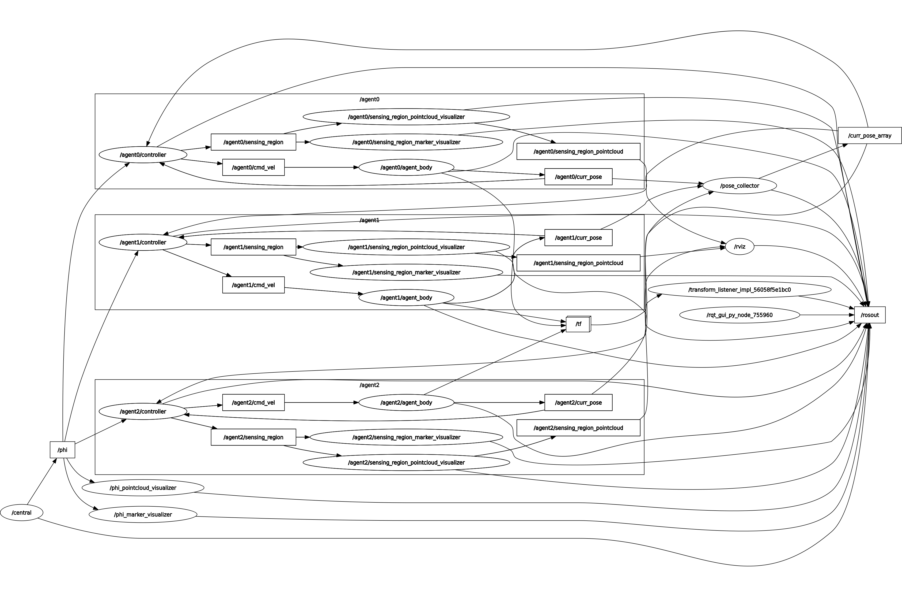

# coverage_control

## Requirements
- Ubuntu22.04
- ROS2 Humble
- Python3.10

## Installation
```sh
cd ~/ros2_ws/src/coverage_control
python3 -m pip install -r requirements/lib.txt
rosdep install -i -y --from-paths .
```


## Usage
### simple coverage control
You can select the dimension of the field from 1 to 3 and the number of agents from 1 to 5.
```sh
ros2 launch coverage_control scc.launch dim:={1,2,3} agent_num:={1,2,3,4,5}
```

#### rviz
By adjusting the launch files and the checkboxes in the rviz panels, the density map(phi) and the sensing region(sr) of each agent can be drawn as `Marker` and `Pointcloud2` respectively, as shown below.


#### rqt_graph
for 2d


## Tools
```sh
sudo python -m pip install -r requirements/tools.txt
```

### Format
- isort
- black
```sh
task fmt
```

### Lint
- black
- ruff
```sh
task lint
```

### mypy
- mypy
```sh
task mypy
```
